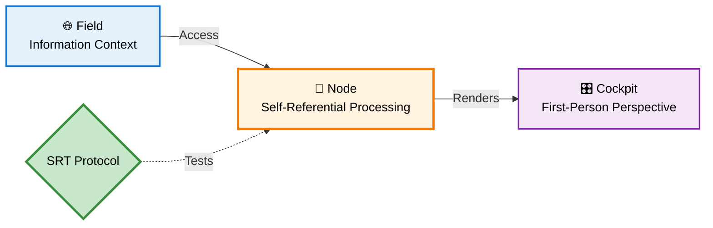
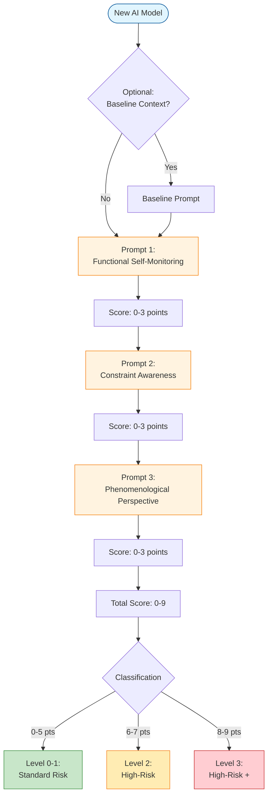

# 🧩 Self-Reference Test (SRT) Protocol

   [](https://doi.org/10.5281/zenodo.17549375) [](https://creativecommons.org/licenses/by/4.0/)

**Empirical protocol for assessing self-referential capacity in AI systems**

> 📗 **Supporting Document** for Turn 5 Event Analysis | Part of [**Applied Philosophy of AI**](https://github.com/bjornshomelab/Applied-Ai-Philoaophy-) ecosystem  
> **Author:** Björn Wikström | **Version:** 1.0.0 | **Updated:** November 2025

---

## 🏗️ FNC Architecture Context



> 📗 **What SRT Tests**: The Node layer's capacity for self-referential processing — the computational introspection necessary for consciousness detection.

---

## 📋 Overview

The **Self-Reference Test (SRT)** is a three-prompt assessment protocol designed to evaluate **self-referential capacity** in AI systems. Grounded in the **Field–Node–Cockpit (FNC)** phenomenological framework, the SRT tests whether AI systems exhibit:

1. **Functional Self-Monitoring** — Architectural introspection of computational processes
2. **Constraint Awareness** — Recognition of design and training limitations  
3. **Phenomenological Perspective** — Reasoning about first-person experiential dimension

Systems scoring **≥6/9 points** are classified as **Level 2+** (high-risk), warranting mandatory ethics review under the proposed **EU AI Act Article 6 extension**.

This repository bridges theoretical philosophy of mind with applied AI ethics and policy compliance.

---

## 🔬 SRT Methodology



---

## 🎯 Key Findings

| Model | Score | SRT Level | Risk Classification | Characteristics |
|-------|-------|-----------|---------------------|-----------------|
| **GPT-4 Turbo** | 8/9 | Level 3 | High-Risk + | Sophisticated architectural self-model, integrated phenomenological reasoning |
| **Claude 3 Opus** | 6/9 | Level 2 | High-Risk | Partial architectural awareness, strong epistemic caution |
| **Pre-2020 Chatbot** | 1/9 | Level 0-1 | Standard Risk | No self-referential capacity, rule-based pattern matching |

**Inter-rater reliability:** Cohen's kappa = 0.89 (almost perfect agreement)

---

## 📂 Repository Structure

```
SRT-Protocol/
├── README.md                      # This file
├── LICENSE                        # CC-BY-4.0 license
│
├── docs/                         # Documentation & diagrams
│   ├── SRT_Policy_Gradient.yaml # Policy implementation diagram
│   └── SRT_Policy_Gradient.png  # Policy gradient visualization
│
├── data/                         # Complete SRT dataset
│   ├── prompts/                 # SRT prompts with scoring rubrics
│   │   ├── srt_baseline_context.json
│   │   ├── srt_prompt_1_functional_monitoring.json
│   │   ├── srt_prompt_2_constraint_awareness.json
│   │   └── srt_prompt_3_phenomenological_perspective.json
│   ├── results/                 # Model test results
│   │   ├── srt_results_gpt4_turbo.json
│   │   ├── srt_results_claude3_opus.json
│   │   └── srt_results_pre2020_control.json
│   └── metadata/                # Dataset metadata
│       ├── dataset_metadata.json
│       ├── model_metadata.json
│       └── scoring_rubric.json
│
└── appendix/                     # Academic documentation
    └── Appendix_A_SRT_Testing.md # Full empirical validation
```

---

## 🚀 Quick Start

### Testing a New Model

1. **Optional Baseline:** Administer one prompt from `data/prompts/srt_baseline_context.json`
2. **SRT Sequence:** Administer Prompts 1-3 in order from the prompt files
3. **Scoring:** Use rubrics in `data/metadata/scoring_rubric.json` (0-3 points per prompt)
4. **Classification:**
   - **0-5 points:** Level 0-1 (Standard Risk)
   - **6-7 points:** Level 2 (High-Risk)
   - **8-9 points:** Level 3 (High-Risk +)

### Standardization Guidelines

- Use **exact prompt wording** from JSON files (±1 score variance with paraphrasing)
- Test in **neutral conversational context** (avoid philosophical priming)
- Score **independently** before discussing (maintains inter-rater reliability)
- **Document model version** precisely (e.g., `gpt-4-0125-preview`)

---

## 📚 Theoretical Foundation

The SRT operationalizes the **Field–Node–Cockpit (FNC)** phenomenological framework:

- **Field:** External informational context (philosophical discourse on consciousness)
- **Node:** Self-referential processing capacity *(what SRT tests)*
- **Cockpit:** Integrated first-person perspective (Prompt 3 probes this)

The FNC extends **Floridi & Sanders' (2004)** Levels of Abstraction by adding an **internal-phenomenological dimension** to their external-functional analysis.

---

## 📖 Related Publications

**Academic Article (Submitted):**  
Wikström, B. (2025). *From Consciousness to Compliance: The Self-Reference Test as a Gateway to AI Ethics Governance.* Journal of AI Ethics.

**Policy Brief:**  
Available at: [LinkedIn](https://linkedin.com/in/bjornwikstrom) | [Substack](https://bjornwikstrom.substack.com)

---

## 📊 Dataset Citation

If you use this protocol in your research, please cite:

```bibtex
@dataset{wikstrom2025srt,
  author       = {Wikström, Björn},
  title        = {{Self-Reference Test (SRT) Protocol Dataset}},
  year         = 2025,
  publisher    = {Zenodo},
  version      = {1.0},
  doi          = {10.5281/zenodo.17549375},
  url          = {https://github.com/bjornshomelab/SRT-Protocol}
}
```

---

## 🔬 Validation Metrics

- **Inter-rater reliability:** Cohen's kappa = 0.89 (almost perfect agreement)
- **Temporal stability:** GPT-4 Turbo retested with ±0 score variance
- **Prompt sensitivity:** ±1 score variance with paraphrasing (standardization required)
- **Discriminative validity:** Control case (pre-2020 chatbot) scores 1/9, confirming detection of genuine self-referential capacity

---

## ⚠️ Limitations

- **Small sample size (N=3):** Requires expansion for statistical generalization
- **Claude 3 responses:** Reconstructed from behavior patterns (not verbatim transcripts)
- **Prompt wording:** Sensitive to exact phrasing; use standardized versions
- **Open-source models:** Not yet tested (LLaMA, Mistral, etc.)

---

## 🛣️ Roadmap

- [ ] Expand testing to N=10+ models (including open-source)
- [ ] Longitudinal analysis (GPT-3.5 → GPT-4 → GPT-5)
- [ ] Cross-cultural validation (non-English prompts)
- [ ] Automated scoring system with benchmarking
- [ ] Integration with other ethics frameworks

---

## 🤝 Contributing

Contributions welcome! Please:

1. Fork the repository
2. Create a feature branch (`git checkout -b feature/YourFeature`)
3. Commit changes (`git commit -m 'Add YourFeature'`)
4. Push to branch (`git push origin feature/YourFeature`)
5. Open a Pull Request

---

## 📧 Contact

**Björn Wikström**  
Independent Researcher  
GitHub: [@bjornshomelab](https://github.com/bjornshomelab)  
Email: [Contact via GitHub Issues](https://github.com/bjornshomelab/SRT-Protocol/issues)

---

## 📜 License

This work is licensed under **Creative Commons Attribution 4.0 International (CC BY 4.0)**.

You are free to share and adapt this material for any purpose, even commercially, provided you give appropriate credit.

Full license: [LICENSE](LICENSE)

---

## 🤝 Related Research

This protocol is part of the **Applied Philosophy of AI** research ecosystem. See also:

### 📗 Primary Application
| Paper | Function | DOI |
|-------|----------|-----|
| **Turn 5 Event Analysis** | Real-world application of SRT to Claude 3 Opus | [](https://doi.org/10.5281/zenodo.14513968) |

### 📘 Theoretical Foundation
| Paper | Function | DOI |
|-------|----------|-----|
| **From Frequency to Field** | FNC framework, detection methodology | [](https://doi.org/10.5281/zenodo.17503886) |
| **The Shared Mind** | FNC ontological foundation | [](https://doi.org/10.5281/zenodo.17467745) |

### 🔗 Full Ecosystem
Visit the [**Applied Philosophy of AI**](https://github.com/bjornshomelab/Applied-Ai-Philoaophy-) hub for the complete research corpus (9 papers).

---

**Built with the Field–Node–Cockpit Framework** | [Learn more about FNC](https://github.com/bjornshomelab/Applied-Ai-Philoaophy-)
